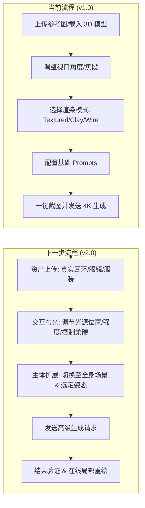

# Virtual Digital Studio (VDS) 2.0 - 产品需求文档 (PRD)

**版本**: v3.0 (2026-01-13)  
**状态**: 草案  

---

## 1. 项目概述 (Project Overview)
**Virtual Digital Studio (VDS)** 是一个结合 3D 仿真与生成式 AI (Gemini 3 Pro) 的摄影工具。其主要目的是通过数字化的方式模拟摄影棚拍摄流程，降低商业摄影的设备与场地成本。用户可以在 3D 视口中配置光源、相机参数及资产，并生成高分辨率的图像。

---

## 2. 目标人群 (Target Audience)

| 目标人群 | 核心需求 | 解决方案 |
| :--- | :--- | :--- |
| **电商从业者** | 降低模特拍摄成本及周期。 | 通过 3D 模型与产品图组合，生成展示图片。 |
| **服装设计师** | 快速验证设计方案的视觉效果。 | 在 3D 影棚中动态调整视角，观察成衣视觉表现。 |
| **摄影/美术指导** | 提高实景拍摄前的方案沟通效率。 | 作为可视化工具，预先确定布光及相机参数。 |
| **个人创作者** | 在有限条件下获取影棚级视觉效果。 | 利用 AI 模拟专业影棚的布光与生成。 |

---

## 3. 核心功能及当前进度 (Status & Features)

### 3.1 当前实现 (Current Capabilities)
当前版本已完成以下功能闭环：

*   **✅ 3D 头部影棚 (3D Head Studio)**:
    *   **✅ 实时视口**: 基于 Three.js 的模型渲染，支持 OrbitControls 观察。
    *   **✅ 渲染模式**: 
        *   ✅ `Textured`: 结合深度图的投影渲染。
        *   ✅ `Clay`: 纯色模型，用于检查结构与阴影。
        *   ✅ `Wireframe`: 几何边框，作为 AI 生成的结构约束。
    *   **✅ 辅助工具**: 集成 GizmoHelper 控制坐标方位。

*   **✅ AI 生成管线**:
    *   **✅ 高分辨率输出**: 基于 Google Vertex AI REST API，支持原生 4K/2K 尺寸。
    *   **✅ 构图还原**: 支持捕捉 3D 视口作为 AI 生成的结构参考（Viewport Capture）。
    *   **✅ 深度处理**: 内置深度图计算，支持 2D 贴图的位移效果。

*   **✅ 摄像机控制**:
    *   ✅ 支持 24mm - 200mm 焦段模拟，同步视口视角。
    *   ✅ 提供特写、全身等标准取景预设。

### 3.2 v2.0 规划功能 (New in v2.0)

#### 1. 布光控制系统 (Lighting Control)
*   **交互式灯光**: 在 3D 场景中添加灯光操纵杆，支持位置调整。
*   **光源类型**:
    *   **柔光 (Soft Light)**: 使用区域光源，阴影边缘平滑。
    *   **硬光 (Hard Light)**: 使用方向光源或点光源，阴影边界清晰。
*   **参数调节**: 
    *   **强度 (Intensity)**: 线性调节光照亮度。
    *   **色温与色号**: 支持标准色温（K）与 Hex 颜色输入。

#### 2. 全身模型与姿态同步 (Full-body & Pose)
*   主体由头部模型扩展至全身模型。
*   支持提取 3D 骨架信息用于生成约束，确保姿态一致性。

#### 3. 资产集成 (Asset Integration)
*   **产品叠加**: 支持上传眼镜、耳环等 PNG 图片，通过 3D 锚点定位至模型。
*   **材质参考**: 通过 Style Reference 功能，将上传的服装图作为生成的参考。

---

## 4. 用户流程说明 (User Flow)

---

## 5. 技术架构设计 (High-level)

*   **前端 (View)**: React 19 + Three.js (Fiber) 负责复杂的光线算力与 3D 渲染。
*   **状态管理**: Zustand 2.0 持久化存储灯光配置、资产元数据。
*   **后端 (API Server)**: FastAPI 负责处理资产上传与异步任务分发。
*   **核心引擎**: Google Vertex AI (Gemini 3 Pro) 负责 100% 构图还原与高清生成。

---

## 6. 路线图 (Roadmap)
*   **Phase 1 (本月)**: 完善 3D 灯光控制台与颜色选择器。
*   **Phase 2 (下月)**: 引入全身模型库与多姿态调节。
*   **Phase 3 (未来)**: 支持自定义资产 Lora 微调训练，实现“一人一模特”的高端定制。

---
*制作: 奕帆*
